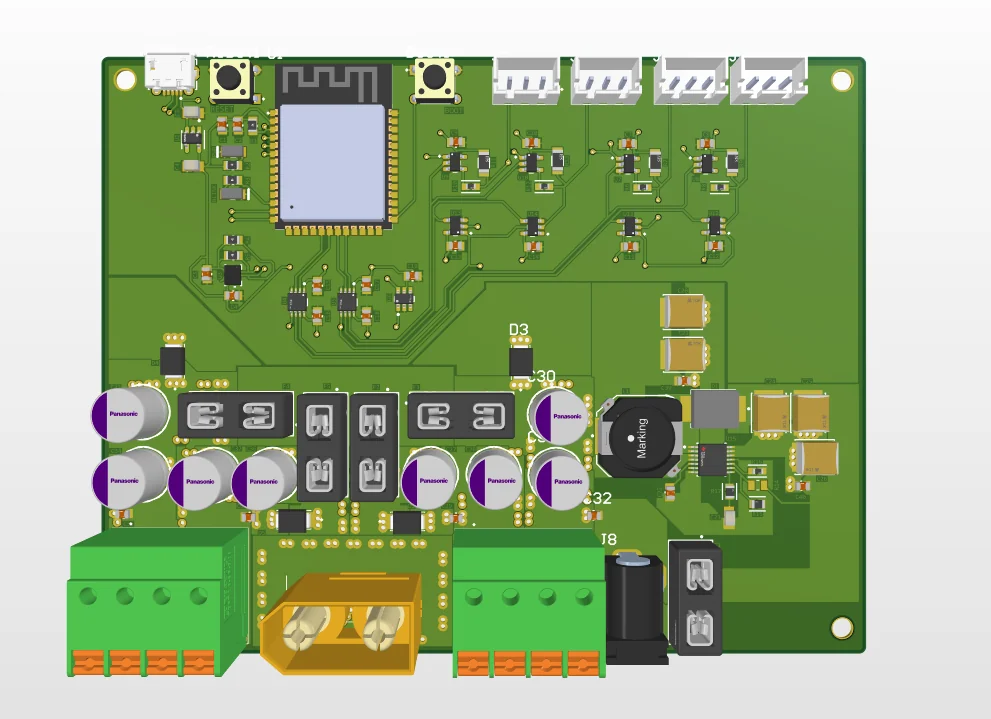
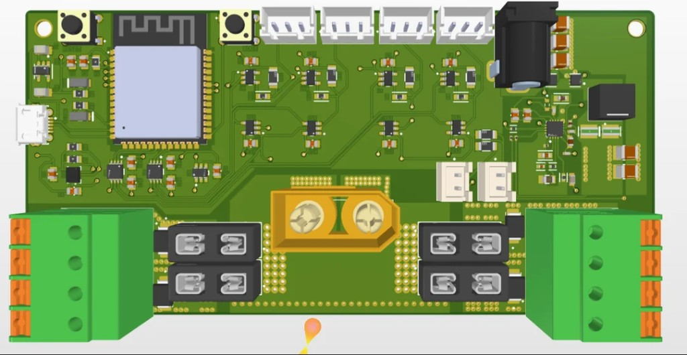
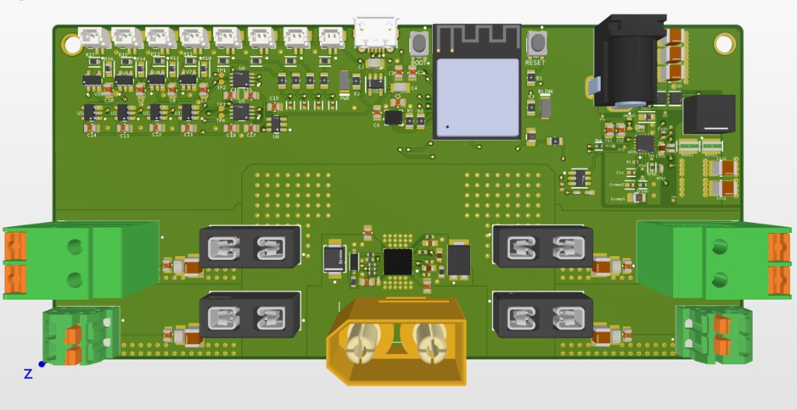

# Electrical

Custom motherboard for ERGOS: servo-bus I/O, power distribution, IMU, foot FSRs, and an 18 V rail for the Jetson Orin Nano.

This is an overview of the current Altium project (V3), not a full bring-up or assembly guide. Schematics and layout are the source of truth.

## What's in this folder

| Path | Contents |
| :--- | :--- |
| [`PCB_Project/ROBOT_PCB_PROJECT.PrjPcb`](PCB_Project/ROBOT_PCB_PROJECT.PrjPcb) | Altium project |
| [`PCB_Project/ROBOT_MOTHERBOARD.PcbDoc`](PCB_Project/ROBOT_MOTHERBOARD.PcbDoc) | Board layout |
| [`PCB_Project/Schematics/`](PCB_Project/Schematics/) | Four schematic sheets + PDF export |
| [`PCB_Project/PCB_BOM.xlsx`](PCB_Project/PCB_BOM.xlsx) | Motherboard component BOM |
| [`images/history/`](images/history/) | V1–V3 board renders |

The robot-level parts list (battery, Jetson, camera, wire, etc.) lives in [`docs/README.md`](../docs/README.md) and will be rebuilt later.

## Board role

The motherboard sits in the torso on the PCB tray. It does four jobs:

1. **Take 3S LiPo power** (nominal 11.1 V) in through an XT90, protect it, and split it.
2. **Feed the servo harness** at battery voltage for the Feetech STS daisy chains.
3. **Boost to 18 V** and send it out a barrel jack to the Jetson Orin Nano Dev Kit. 18 V is used instead of 19 V to leave more buffer on the Jetson input.
4. **Talk to the servos** from an ESP32-S3 over two half-duplex TTL buses, and read the on-board IMU plus foot FSRs.

The Jetson is the high-level computer (ROS 2, camera, policies). The ESP32 is the real-time bus master. They connect over USB: the Jetson both talks to the MCU and **powers the logic side of the PCB** (ESP32 and 3.3 V rail). Servo/power electronics stay on the battery + eFuse path.

## Schematic sheets

| Sheet | What it covers |
| :--- | :--- |
| `MCU_IMU.SchDoc` | ESP32-S3-MINI-1-N8, 3.3 V LDO, USB, boot/reset, BMI323 IMU |
| `UART_LOGIC.SchDoc` | Full-duplex MCU UART → half-duplex STS bus transceivers / buffers (two buses) |
| `Battery_power.SchDoc` | XT90 input, TVS, eFuse, servo-rail distribution and connectors |
| `Jetson_power.SchDoc` | TPS43060 boost 11.1 V → 18 V, barrel-jack output |

A combined PDF is in [`PCB_Project/Schematics/Schematics_PDF.PDF`](PCB_Project/Schematics/Schematics_PDF.PDF).

## Power tree

```
3S LiPo 8400 mAh  (11.1 V nominal)
        │
        ▼
   XT90  →  TVS  →  TPS25985 eFuse
                    │
        ┌───────────┴───────────┐
        ▼                       ▼
  Servo harness (11.1 V)   TPS43060 boost → 18 V barrel jack → Jetson
        │                                              │
        ├─ Neck                                        └─ USB 5V → PCB logic (ESP32)
        ├─ Right arm / right leg
        └─ Left arm / left leg
```

Servo power is not a second regulated 12 V rail; the STS servos run from the 3S pack through the eFuse and harness. The Jetson is fed 18 V on its barrel jack; it then powers the ESP32 side of this board over USB.

There are also keyed fuse holders on the board (`F2`–`F5`) for downstream rails.

## Communication

Two independent **1 Mbps half-duplex Feetech SCS/STS** buses. The MCU UARTs are full duplex; on-board logic (level shifters, inverters, 3-state buffers) turns each into a single-wire TTL servo bus with a direction pin.

Bus split:

- **Bus 1** — neck, right arm, right leg
- **Bus 2** — left arm, left leg

The Jetson talks to the ESP32 over USB (CDC UART) and supplies logic power on that same link. The OAK-D Lite is USB 3.0 into the Jetson, not into this board.

On-board sensors:

- **BMI323** IMU on I²C to the ESP32
- **Foot FSRs** — two per foot, on MCU ADC

## BOM

Motherboard components: [`PCB_Project/PCB_BOM.xlsx`](PCB_Project/PCB_BOM.xlsx)

Robot-level BOM (battery, compute, mechanical, wire): [`docs/README.md`](../docs/README.md) — out of date, rebuild comes last.

## Mechanical fit

CAD for the board is `mechanical/ERGOS_V1.4/Assemblies/ROBOT_MOTHERBOARD.SLDASM` (and the matching `.step`). It mounts in `PCB-tray` in the chassis, with the Jetson on its own mounter above/beside it.

## Firmware on this board

Bring-up sketches that toggle the half-duplex direction pin and talk to an STS servo are in [`software/src/Arduino/Examples/`](../software/README.md). They are not the production firmware.

Servo comms use a project-specific Feetech STS library: **[ERGOS_FTServo_Arduino](https://github.com/Bryanh002/ERGOS_FTServo_Arduino)** — not the stock Feetech `SCServo` package. Same note is in the [software](../software/README.md) docs.

## Board history

Descriptions of what changed between revisions will go here later.

### V1



### V2



### V3 (current)



## Still to document

- Connector pinouts and harness drawing
- Measured current budgets (idle / walking)
- Programming / boot-button procedure
- First-power checklist
