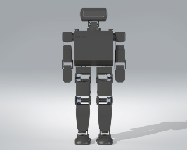

# Mechanical

ERGOS V1.4 is the current mechanical design: a 20-DOF 3D-printed humanoid with belt-driven joints and Feetech STS serial servos.

This page is a map of the CAD, not a full assembly manual. That manual will live here when the build is stable enough to write down.

## What's in this folder

| Path | Contents |
| :--- | :--- |
| [`ERGOS_V1.4/`](ERGOS_V1.4/) | Current robot — parts, assemblies, STEP exports |
| [`ERGOS_Tether_V2/`](ERGOS_Tether_V2/) | Walking-support frame (4040 extrusion, casters) |
| [`ERGOS_Tether_V1/`](ERGOS_Tether_V1/) | Earlier tether |
| [`Renders/`](Renders/) | Interactive 360° viewers and stills |
| [`Prototypes [Legacy]/`](Prototypes%20[Legacy]/) | V1–V1.3 CAD kept for history |

Open **`ERGOS_V1.4/Assemblies/Final_Robot_Assembly.SLDASM`** for the full robot.

## Design snapshot (V1.4)

- **Structure:** printed housings (PLA for most structure; TPU where compliance is needed) with COTS bearings, shafts, and fasteners
- **Actuation:** Feetech STS3250 on the high-load joints (hips, knees, shoulders) and STS3235 on lighter joints (arms, neck)
- **Transmission:** selected joints use HTD-3M belts — 18T pulley on the servo side, 30T on the output — for torque at the expense of speed
- **Packaging:** battery, motherboard, and Jetson Orin Nano in the torso; OAK-D Lite in the head behind the visor
- **Support:** a 4040 tether so early walking tests do not dump the robot on the floor

Datasheets for the servos are in [`docs/Datasheets/`](../docs/Datasheets/).

## CAD layout (V1.4)

```
ERGOS_V1.4/
  Assemblies/     top-level and subsystem assemblies
  Parts/          printed parts + COTS models used in those assemblies
  Exports/        STEP for print / fab / sharing
```

### Top-level assemblies

| Assembly | Role |
| :--- | :--- |
| `Final_Robot_Assembly.SLDASM` | Full robot |
| `Chassis_Assembly.SLDASM` | Torso, battery, PCB tray, Jetson |
| `Robot_Head_Assembly.SLDASM` | Head, visor, OAK-D Lite, neck |
| `Shoulder_Assembly_Left/Right.SLDASM` | Shoulders |
| `Upper_Arm_Assembly.SLDASM` / `Lower_Arm_Assembly.SLDASM` | Arms |
| `Hip_Housing_Assembly_Left/Right.SLDASM` | Hips |
| `Thigh_Housing_Assembly_Left/Right.SLDASM` | Thighs |
| `Shin_Left/Right_Assembly.SLDASM` | Shins |
| `Ankle_Assembly_Left/Right.SLDASM` | Ankles / feet |
| `Jetson_Orin_Nano_Assembly.SLDASM` | Orin Nano + mounter |
| `ROBOT_MOTHERBOARD.SLDASM` | Motherboard STEP in CAD |
| `Oak-d-lite.SLDASM` | Camera |

Left/right copies of housings are explicit parts (not a single mirrored configuration), so print the matching file for each side.

### Joints and hardware that show up often

- **Pulleys:** `HTD3M-18T-8mm`, `HTD3M-30T-10mm`
- **Shafts:** 8 mm aluminum, several cut lengths (about 30 mm and 68 mm in CAD)
- **Bearings:** MR148 and 6801-2RS at different joints
- **Servo interface:** 25T spline horns (`Servo-horn-gear`, `Servo-horn-smooth`) and GoBilda 8 mm round servo shafts where the belt stage needs a round shaft
- **Shims:** 8×11×0.25 mm washers

A print list, belt lengths, and fastener callouts will go here when the BOM is rebuilt. Do not treat [`docs/README.md`](../docs/README.md) as exact quantities until that happens.

## Tether

`ERGOS_Tether_V2/` is a rolling 4040 frame with casters so the robot can walk with catch support. Use this for Phase 4 (sim-to-real walking) before untethered tests.

## Renders

Current SolidWorks visualizer export. Open [`Renders/ERGOS-Interactive/Data/index.html`](Renders/ERGOS-Interactive/Data/index.html) locally and drag to rotate.

<p align="center">
  
</p>

Still images used on the GitHub README: [`docs/images/ERGOS-Rendered-images/`](../docs/images/ERGOS-Rendered-images/).

## Still to document

- Exploded assembly order (this is the hard one — it will be its own section)
- Print settings, material per part, and support strategy
- Belt routing and tension
- Wiring paths through the limbs into the torso harness
- Mass properties / COM from the SolidWorks assembly
